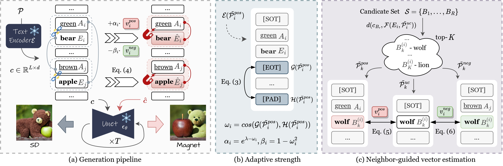
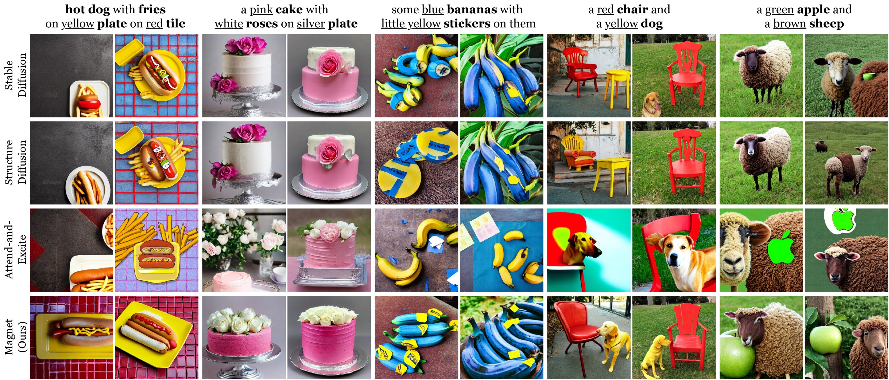
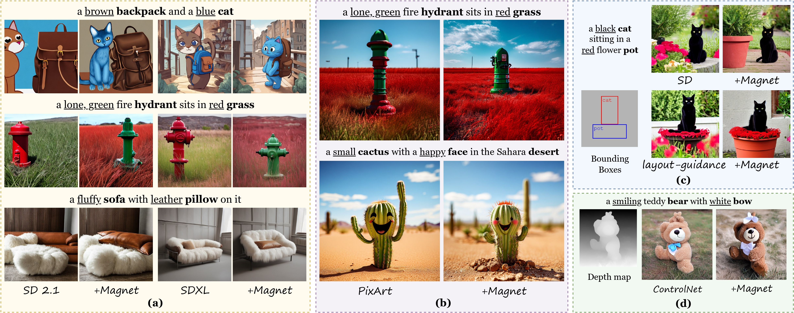

<div align="center">
<h1>Magnet: We Never Know How Text-to-Image Diffusion Models Work, Until We Learn How Vision-Language Models Function</h1>


[Chenyi Zhuang](https://chenyi-zhuang.github.io/), Ying Hu, Pan Gao

[I2ML](https://i2-multimedia-lab.github.io/), Nanjing University of Aeronautics and Astronautics

[Paper]()

<p><B>We propose Magnet, a training-free approach that improves attribute binding by manipulating object embeddings, enhancing disentanglement within the textual space.</B></p>

</div>

<div align="left">



### 🌟 Key Features
1. In-depth analysis and exploration of the CLIP text encoder, highlighting the context issue of padding embeddings;
2. Improve text alignment by applying positive and negative binding vectors on object embeddings, with negligible cost.
3. Plug-and-play to various T2I models and controlling methods, e.g., ControlNet.

### ⚙️ Setup and Usage
```bash
conda create --name magnet python=3.11
conda activate magnet

# Install requirements
pip install -r requirements.txt
```

If you are curious about how different types of text embedding influence generation, run ``emb_swap_cases.py`` to reproduce the swapping experiment.

To test Magnet, specify the path of pre-trained [SD V1.4](https://huggingface.co/CompVis/stable-diffusion-v1-4), [SD V2.1](https://huggingface.co/stabilityai/stable-diffusion-2-1-base), or [SDXL](https://huggingface.co/stabilityai/stable-diffusion-xl-base-1.0) in ``run_magnet.py``.

You can also try [ControlNet](https://huggingface.co/lllyasviel/sd-controlnet-depth) conditioned on Depth estimation [DPT-Large](https://huggingface.co/Intel/dpt-large) in ``run_magnet_with_controlnet.py``.

### 😺 Examples



## TODO
- [x] Release the source code and model.
- [x] Extend to more T2I models.
- [x] Extend to controlling approaches.

</div>
